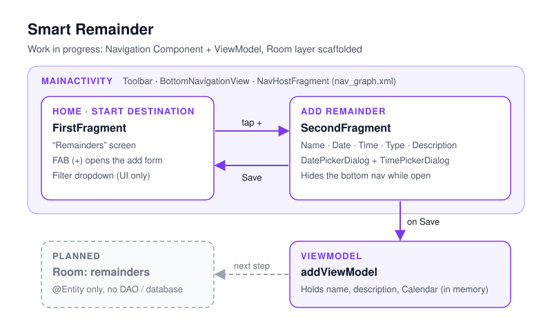

# Smart Remainder

A reminder app for Android built with the Navigation Component and ViewModel. It's an early work in progress: you can fill in reminders, but they aren't stored or scheduled yet.


> **Status: learning project, in progress (2023).** I started this to learn the Jetpack Navigation Component, ViewModels and Room. The add-reminder flow works. Saving to a database, showing the saved list and firing notifications are not built yet. The diagram below shows the existing code and the planned parts.

<p align="center">
  
</p>

<!-- Add screenshots to docs/screenshots/ -->

## Features

**Implemented**
- A two-screen flow on the Navigation Component. The home screen ("Remainders") has a floating action button that opens the **Add Remainder** form.
- The Add Remainder form has name, type and description fields, a date picker (`DatePickerDialog`) and a time picker (`TimePickerDialog`). The chosen date and time show on the buttons.
- **Save** copies the name, the description and the chosen `Calendar` into `addViewModel`, then goes back to the home screen.
- The bottom navigation bar hides while the add form is open and comes back when you leave it.

**Not implemented yet**
- Saving reminders: only the Room `@Entity` (`remainders`) exists. There's no DAO or `@Database`.
- A list of saved reminders on the home screen. The filter dropdown is layout only.
- Alarms and notifications.

## Tech stack

| Area | Used |
|---|---|
| Language | Kotlin 1.8.20 |
| UI | Android Views (XML), ViewBinding, Material Components (`MaterialToolbar`, `BottomNavigationView`, `FloatingActionButton`, `TextInputLayout`), `ConstraintLayout` |
| Navigation | Jetpack Navigation Component 2.5.2 (`nav_graph.xml`, `NavHostFragment`, `setupActionBarWithNavController`) |
| State | `androidx.lifecycle` ViewModel 2.6.0 |
| Persistence (scaffolded) | Room 2.5.2 runtime, one `@Entity` |
| Build | Gradle 8.0, Android Gradle Plugin 8.0.2 (Groovy DSL) |

## Architecture

One activity (`MainActivity`) holds the toolbar, the bottom navigation and a `NavHostFragment`. `FirstFragment` is the start destination, and its FAB goes to `SecondFragment`. `SecondFragment` shows the date and time pickers and, on **Save**, writes the values into `addViewModel` before going back. That ViewModel belongs to `SecondFragment`, so the data stays in memory only and is gone once you leave the form. The next step is a Room DAO and database behind the existing `remainders` entity.

## Project structure

```
app/src/main/java/com/example/smartremainder/
├── MainActivity.kt              # Toolbar, bottom nav, NavHost, togBar()
├── home/
│   ├── FirstFragment.kt         # Home / "Remainders" screen, FAB → add
│   └── homeViewModel.kt         # Placeholder ViewModel
├── addRemainder/
│   ├── SecondFragment.kt        # Add-reminder form, date & time pickers
│   └── addViewModel.kt          # Holds the form values
└── db/
    └── remainders.kt            # Room @Entity (id, name, calendar, description)
```

## Getting started

**Requirements:** Android Studio Flamingo or newer (AGP 8.0), JDK 17, and a device or emulator on Android 8.0 (API 26) or later.

| | |
|---|---|
| `minSdk` | 26 |
| `targetSdk` / `compileSdk` | 33 |

```bash
git clone https://github.com/darsh-7/Smart_Remainder.git
```

Open the project in Android Studio, let Gradle sync, and run the `app` configuration.

**Permissions:** none requested.

## License

[MIT](LICENSE) © 2023 Mostafa Ahmed

## Author

**Mostafa Ahmed**, Android developer

[](https://github.com/darsh-7)
[](https://www.linkedin.com/in/darsh7/)
